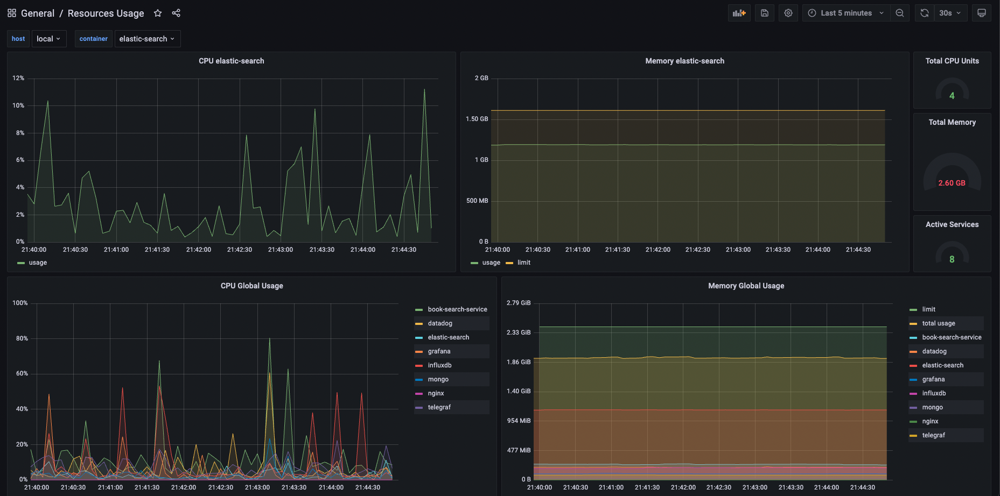
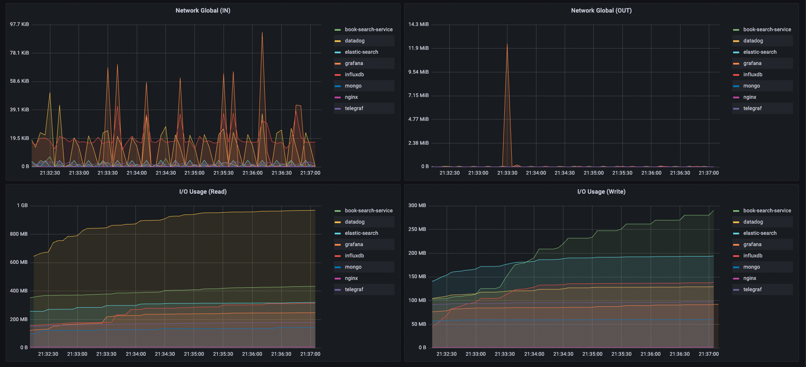
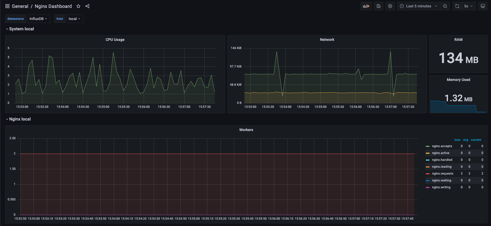
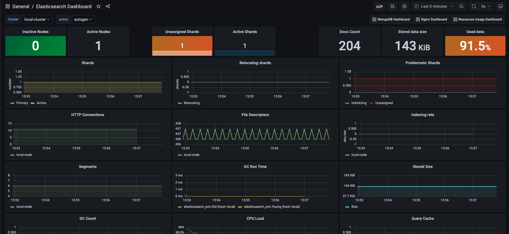
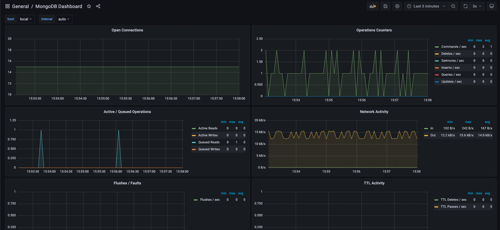
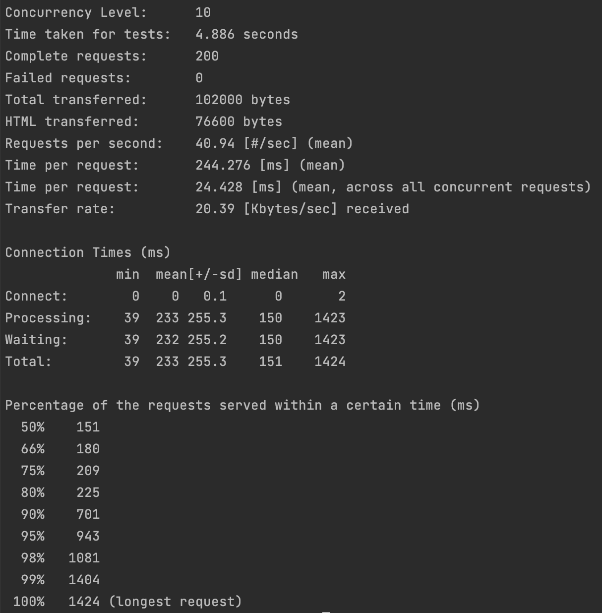
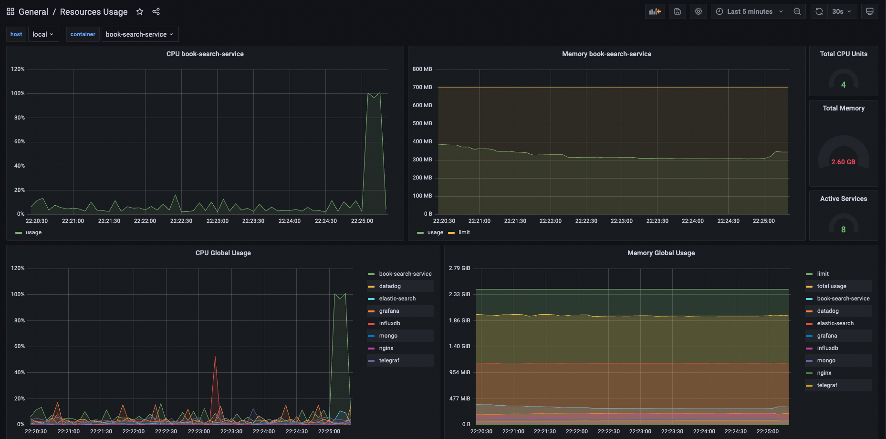

# Highload Software Architecture 
## Homework 3 :: Resources monitoring

docker-compose contains TIG(Telegraf + InfluxDB + Grafana) stack and sample backend infrastructure:
* infrastructure
    * nginx
* databases
    * InfluxDB
    * ElasticSearch
    * MongoDB
* backend
    * book-search-service
* monitoring:
    * grafana
    * telegraf

### Repo contains prepared Dashboard for Grafana:
* Common Resources Usage Dashboard
  
  
* Nginx Dashboard
  
* ElasticSearch Dashboard
  
* MongoDB Dashboard
  


### Backend logic
* nginx --(proxy)--> book-search-service
* book-search-service --(find books by search query)--> ElasticSearch
* book-search-service --(find books by returned list of id)--> MongoDb

## Usage
Build backend service
```
cd book-search-service
mvn clean package
```

Start up local stack
```
docker-compose up
```

Load test data to service(books fetched from Google API)
```
./book-search-service/init.sh
```

## Load Testing
Use prepared script to run Apache Benchmark test(200 requests, 10 concurrency)
```
./load-testing.sh
```

