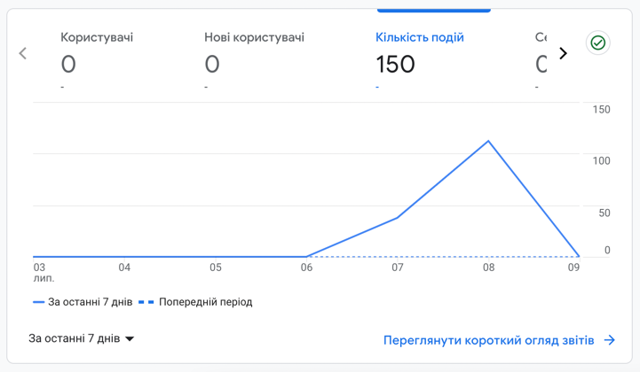
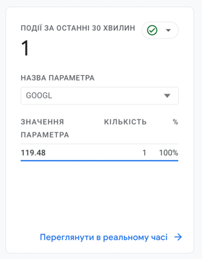
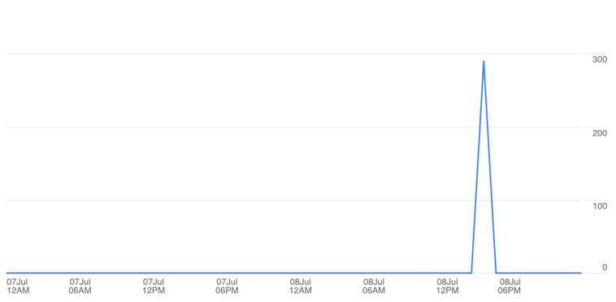
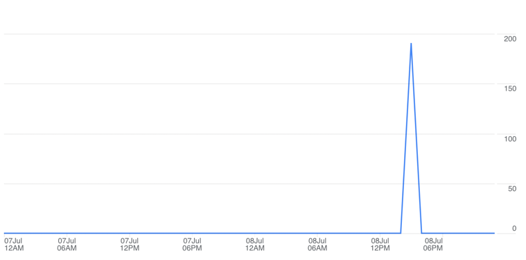
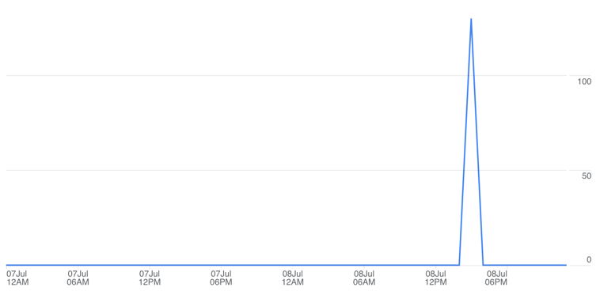
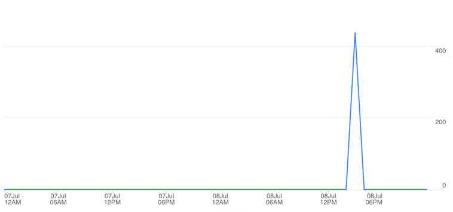
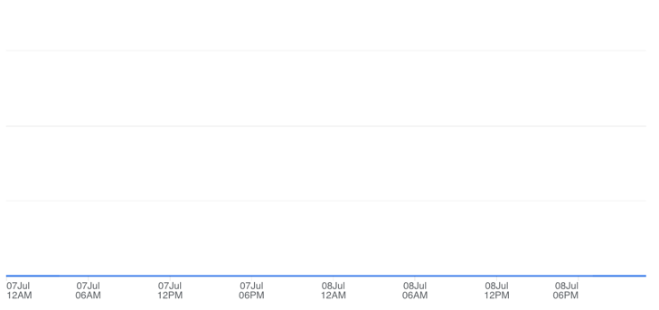
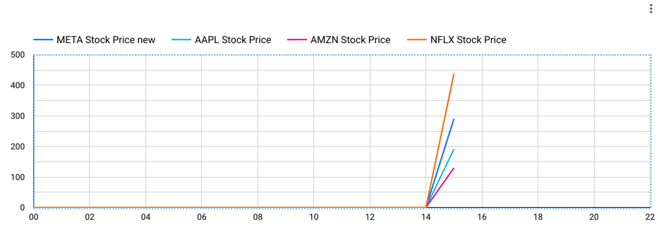

# Homework 4 :: Monitoring systems for user metrics 
## Implementation

Service *google-analytics-integration-service* use [YahooFinance](https://query1.finance.yahoo.com//v10/finance/quoteSummary/{stockSymbol}?modules=price)
API to retrieve FAANG companies Stocks price and publish it(each 5 minutes) to Google Analytics using 
GAMP(Google Analytics Measurement Protocol).

Event payload:
```json
{
    "client_id": "1111111111.2222222222",
    "events": [
        {
            "name": "stock_prices",
            "params": {
                "META": <price>,
                "AAPL": <price>,
                "AMZN": <price>,
                "NFLX": <price>,
                "GOOGL": <price>,
            }
        }
    ]
}
```

## Google Analytics


### Facebook(META) 

### Apple (AAPL)

### Amazon (AMZN)

### Netflix (NFLX)

### Google (GOOGL)
(By some reason Google Analytics decided to not show itself price)


## Looker Studio
